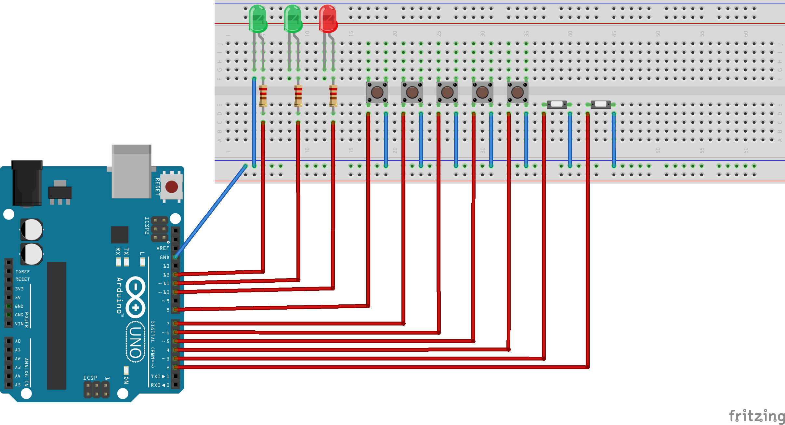
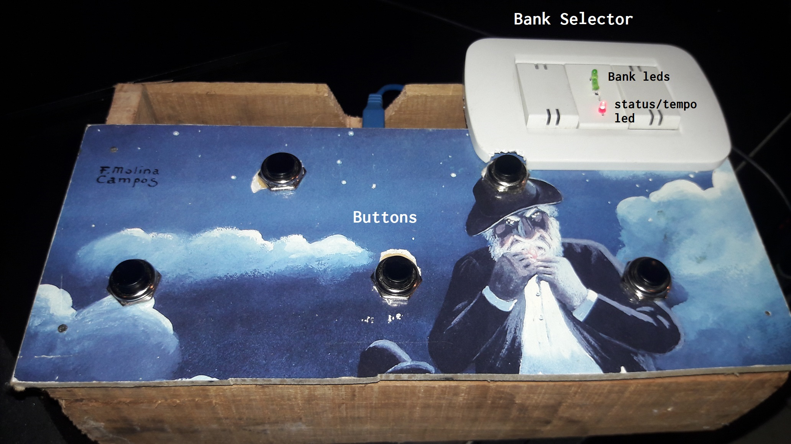

# Arduino Midi (foot) controller.

A simple midi controller with bank selector, thought to be used as a MIDI foot controller for looper applications such as mobius.

## Getting Started  

- [Build your controller](#schematics)
- Modify ArduinoMidiFootController.uno to match your controller buttons and banl selector switches.
- Upload to arduino.
- Use Hairless midi to convert Serial messages to MIDI
- Use MidiLoop to route midi to other applications.

## How to make it work on windows.  

* [Hairless MIDI](http://projectgus.github.io/hairless-midiserial/) - Needed to convert Serial messages to MIDI
* [Loop MIDI](MIDIhttp://www.tobias-erichsen.de/software/loopmidi.html) - This software can be used to create virtual loopback MIDI-ports to interconnect applications on Windows that want to open hardware-MIDI-ports for communication.

## [Schematics](#schematics)

This is a simple 5 button 4 banks controller.  

## Contributing  

Feel free to contribute to the project, the only requirement is to have light comments.

## Authors  

* ** Rodobodolfo ** - *Initial work* - [rodobodolfo](https://github.com/rodobodolfo)

## License  

This project is licensed under the MIT License - see the [LICENSE.md](LICENSE.md) file for details

